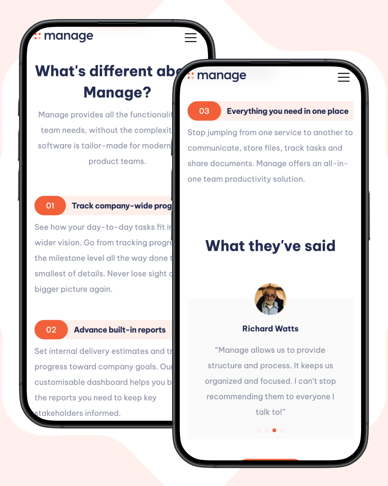
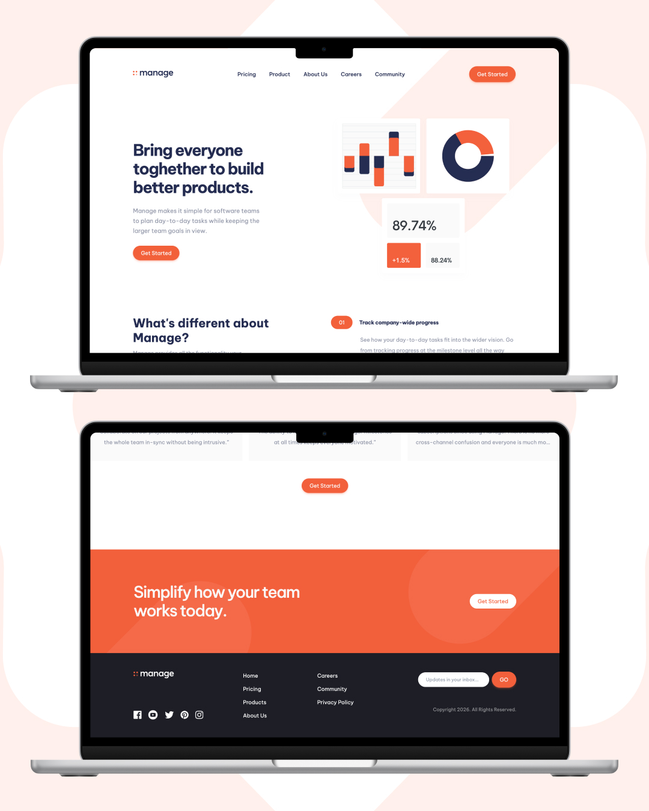

# Frontend Mentor - Manage landing page solution
This is a solution to the [Manage landing page challenge on Frontend Mentor](https://www.frontendmentor.io/challenges/manage-landing-page-SLXqC6P5). Frontend Mentor challenges help you improve your coding skills by building realistic projects. 
## Table of contents
- [Overview](#overview)
  - [The challenge](#the-challenge)
  - [Screenshot](#screenshot)
  - [Links](#links)
- [My process](#my-process)
  - [Built with](#built-with)
  - [What I learned](#what-i-learned)
- [Author](#author)
## Overview
### The challenge
Users should be able to:
- View the optimal layout for the site depending on their device's screen size
- See hover states for all interactive elements on the page
- See all testimonials in a horizontal slider
- Receive an error message when the newsletter sign up `form` is submitted if:
  - The `input` field is empty
  - The email address is not formatted correctly
### Screenshot

### Links
- Solution URL: [Solution URL](https://www.frontendmentor.io/challenges/manage-landing-page-SLXqC6P5?tab=report)
- Live Site URL: [Live URL](https://fm-manage-landing-pi.vercel.app/)
## My process
### Built with
- Semantic HTML5 markup
- Tailwind
- Flexbox
- CSS Grid
- Mobile-first workflow
- GSAP
- Astro.js
### What I learned
This project was my first time using **GSAP** for animation, and I'm most proud of being able to implement it across the whole page. Getting comfortable enough with GSAP to animate the entire landing page, rather than just a small isolated element, felt like a real step up from my usual CSS-only approach to motion.

That said, it wasn't a smooth ride. Since I'd never used GSAP before, I struggled quite a bit trying to get the animations to behave the way I envisioned. A lot of trial and error went into figuring out timing, sequencing, and how GSAP's API differs from plain CSS transitions. I got through it with help from friends and some AI tools, which pointed me in the right direction when I got stuck.

If I were to do this again, I'd spend more time going through GSAP's documentation upfront instead of jumping straight into implementation — it would've saved me some of the trial-and-error struggle.
## Author
- Frontend Mentor - [@codesbyree](https://www.frontendmentor.io/profile/codesbyree)
- Instagram - [@ree.software](https://instagram.com/ree.software)
- LinkedIn - [Saepul Bahri](https://www.linkedin.com/in/swe-bahree/)
